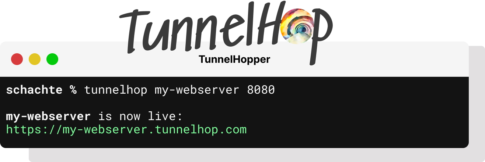

[](https://choosealicense.com/licenses/mit/)


<center>
<div width="100%">
        
</div>
</center>

---

# Development Environment

TunnelHop is a CLI and web-based application that allows you to expose locally running servers, databases and applications to the public internet without any additional infrastructure. 

In order to reduce complexity of managing redundant dependencies between all of the TunnelHop microservices, this repo houses the shared dependencies for local development such as logging, metrics, and visualization containers. 

Typical usage is to use this repository as a submodule to easy keep changes in sync across all repos.

## Submodule Usage

**Add repo as submodule**
`git submodule add https://github.com/TunnelHop/TunnelHop-Development.git development`

**Pull updates submodule changes**
`git submodule update --remote`

## Docker-Compose

There is a sample `docker-compose` yaml in this repo that can be used directly or as a reference for dependencies when developing locally.

_Run docker-compose_
```sh
make run-compose
```

_Kill docker-compose_
```sh
make kill-compose
```